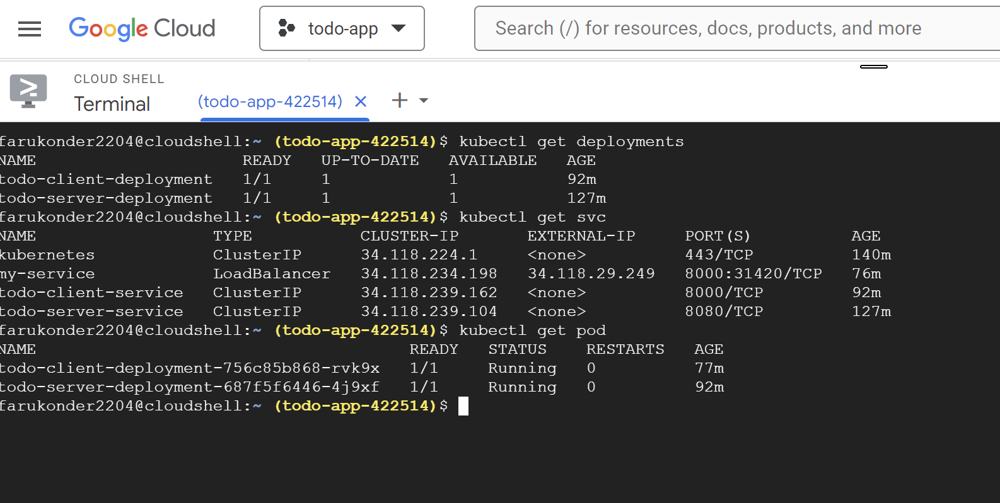
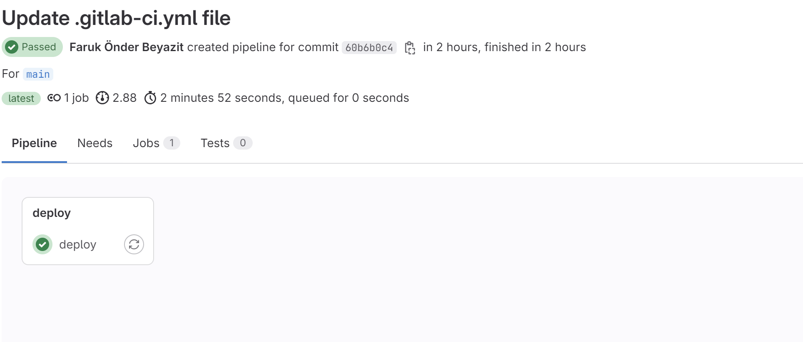
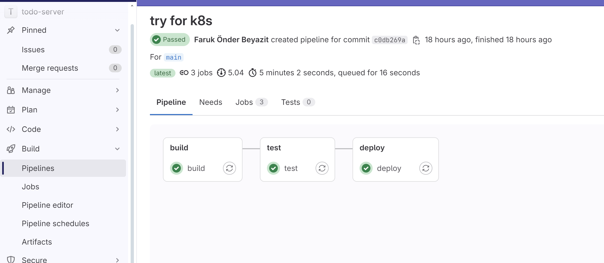

# Özet

Uygulamayı TDD prensipleri çerçevesinde geliştirmeye çalıştım. İlk olarak localde bütün testlerimi çalıştırıp beklentilerime göre sonuçları aldıktan sonra da uygulamayı yazıp ve ayaga     kaldırdım. Localdeyken sorun yaşadıgım şey şu oldu contract testingte consumer ile pact oluşturdum hatta bunu pact-flowa publishledim fakat provider kısmında bir türlü verify edemedim.
pact broker url alma kısmında sorun yaşadım dockerize edip localde yapabilirdim ama bunu ci-cd ye entegre edemezdim.sonra uygulamayı contract testing olmadan ayağa kaldırdım ve istediğim gibi çalışyıordu localde bunun yaml dosyalarını oluşturup minikube üzerinde deployment ve servislerini burda oluşturup bulut ya da uzak sunucularla uğraşmyayım dedim fakat minikube linux işletim sistemimin root kısmını doldurdu açamaz hale geldim linuxu sonrasında ben de gke ye deploy ettim. ve son olarak pipeline kısmına geleyim burada da ortam sıkıntısı yaşadım localimde düzgünce çalışan testleri pipeline aktaramadım dockerize edip ortamdan bağımsız da yapamadım. sadece go unit test kısmını pipeline ile kontrol edebildim deployment ve build aşamalarında bir sorun olmadı.Aşağıda client ve servisin link ve bazı fotoğrafları bulunmakta.

    
## K8S

 
# Client
<a href="https://gitlab.com/farukbey09/todo-client"><strong>Client Gitlab URL</strong></a>

## E2E TESTING
https://github.com/farukbey09/tech-task/assets/59178479/5c51986f-23f1-471c-95a0-bed31cd953d9

## Pipeline

# Server
<a href="https://gitlab.com/farukbey09/todo-server"><strong>Server Gitlab URL</strong></a>

## Pipeline

